# Cascade Casa

## What is Cascade Casa?

*Cascade Casa is an interactive 2D home decor simulation game designed to teach CSS concepts through home decoration and design challenges. Players will apply CSS properties to arrange furniture, customize rooms, and unlock new areas of a virtual house while solving progressively more challenging styling puzzles.*

## Influences

- *Influence #1*: Stardew Valley [https://www.stardewvalley.net/]
Inspires the cozy, cutesy art style and open-ended gameplay with rewarding progression mechanics.
- *Influence #2*: Grid Garden [https://cssgridgarden.com/]
Demonstrates how CSS grid layout can be gamified.
- *Influence #3*: Flexbox Froggy [https://flexboxfroggy.com/]
Another CSS related game that showcases how puzzles is also a fun learning style.
- *Influence #4*: The Sims [https://en.wikipedia.org/wiki/The_Sims]
The house customization and object placement mechanics are similar to how players will use CSS to style and position objects in Cascade Casa.
## Core Gameplay Mechanics 
- *CSS-Based Puzzles: Players apply CSS properties to style rooms and arrange furniture.*

- *Level Progression: Different rooms introduce new CSS concepts, starting from basics to advanced topics.*

- *Customizable Home: Players can personalize their home using CSS principles like Flexbox, Grid, and animations.*

- *Magic Journal Guide: Acts as a narrator and interactive tutorial, guiding players through levels and challenges.*

## Core Gameplay Dynamics
- *Problem-Solving & Iteration: Players experiment with CSS properties, receive feedback, and iterate to find the best design solutions.*
- *Narrative Engagement: A storyline with a magic journal adds depth, helping to make the game more engaging.*
- *Creative Expression: The game encourages customization and self-expression through decor choices.*
# Learning Aspects
## Learning Domains
*UI/UX Design*
*Web Development*
## Target Audiences
*Beginner & Inermediate CSS users*
*Hobbyists interested in web development*
*K-12 students (Middle school and up)*
## Target Contexts
*Computer Lab*
*Self-pace course learning modules*
*Open source educational web development game*
## Learning Objectives
- *CSS Layouts*: *By the end of the instructions, learners are able to apply Flexbox & Grid through structuring rooms*
- *Box Model*: *By the end of the instructions, learners are able to adjust margins, padding, and borders through designing furniture arrangements*
## Prerequisite Knowledge
- *Basic HTML*
- *Foundational Technology Knowledge*
## Assessment Measures

*Room Challenges:Each room presents a CSS-based task that must be solved before progressing.*

*Completion Objects: Players earn more household items for mastering different CSS topics.*

*Pre/Post Assessment: Optional quizzes in the form of Magic Journal story-telling to measure improvement in CSS understanding*
# What sets this project apart?
- *Aesthetic & Engaging UI: A 2D pixel-art interface with cute art style and soundtrack will attract a lot of design enthusiasts.*
- *Hands-on CSS Learning: Unlike static coding tutorials, Cascade Casa integrates interactive design challenges.*
- *Adulthood & Story-telling Gameplay: The magic journal provides an exciting journal and motivation for students when they get to own and decorate their first house fresh out of college*
# Player Interaction Patterns and Modes

## Player Interaction Pattern
- *Single-player, self-paced learning experience.*
- *Drag-and-drop to visualize CSS effects.*
- *Code input and preview system (text-matching) to see real-time changes.*
## Player Modes
- *Learning Mode*: *Progress through different house levels, unlocking new rooms and CSS concepts, and follow a storyline*
- *Test Mode/Free-play mode*: *Experiment with CSS freely in a sandbox environment. This mode can help players to get used to the game more and also to test out their own creative layout*
# Gameplay Objectives
- *Primary Objective #1: Enter the correct "spells" in the magic journal to learn CSS syntax*:
    - Description: *Players must correctly style elements within each room using CSS properties by filling in the blank in the magic journal*
    - Alignment: *Reinforces learning objectives by requiring correct application of CSS rules*
- *Primary Objective #2: Unlock & Customize Rooms*:
    - Description: *Successfully styling rooms unlocks new sections of the house.*
    - Alignment: *Encourages iterative learning and experimentation with different CSS techniques & a linear learning progression*

# Procedures/Actions

*Click to Choose Action: Navigate between different levels, move forward, go back, or access revision materials*

*CSS Input Journal: Type the correct CSS code with or without hints in the magic journal to solve styling challenges.*

*Hint & Help Bar: Unlock a help revision section in the bar upon completing a room, allowing learners to revisit and reapply concepts later in the game.*

*Dragging Objects: Click and move unlocked furniture within the room to visualize positioning changes.*

*Magic Journal Hints: Receive hint for new concepts.*

# Rules

*Each level has specific CSS objectives (e.g., "Center the sofa using Flexbox").*

*Players must meet the level requirements before proceeding.*

*Limited hints available per level.*

# Objects/Entities

*Furniture & Decor Items: Objects styled using CSS properties.*

*Magic Journal: Main companion -- guides players and tracks progress.*

*Rooms & Houses: Different levels correspond to CSS concepts.*

## Core Gameplay Mechanics (Detailed)

*Core Mechanic #1: CSS-Based Designs*
- Positioning and Movement:
    position: (static, relative, absolute, fixed)
    top, left, right, bottom: for moving elements
    transform: for animations (translate, rotate, scale)
- Color and Background:
    color: text color
    background-color: background color of elements
    background-image: adding images as backgrounds
- Text and Font:
    font-size: changing text size
    font-family: choosing different fonts
    text-align: aligning text (left, center, right)
- Box Model (Spacing):
    margin: space outside the element
    padding: space inside the element
    border: defining borders and border-radius for round edges
- Flexbox (Alignment):
    display: flex; for arranging items horizontally or vertically
    justify-content: for horizontal alignment
    align-items: for vertical alignment
- Animations and Transitions:
    transition: for smooth changes
    keyframes: for custom animations
- Visibility and Display:
    display: block, inline, none, flex, grid
    visibility: visible, hidden

*Core Mechanic #2: Challenge & Progression System*
Each room introduces a new CSS concept, ensuring incremental learning. Progress is tracked through in-game achievements.

    
## Feedback
- *Types of learning feedback: Praise & Encouragement, Result, Explaination of Mistake, Hint on Next Step, Metacognitive Guidance*
- *Valence: Positve*
- *Channels used: SFX & Animaations*
- *Some examples:*
- *Real-Time Changes: Shows immediate effects of CSS changes.*
- *Audio & Visual Cues: Success animations and sounds for correct solutions.*
- *Journal Progress Reports: Summarizes completed challenges and unlocked skills.*
# Story and Gameplay

## Presentation of Rules

*For game rules, there will be an onboarding process where a cursor pointer demonstrates how to interact with the game. Players will be asked to try out basic mechanics such as dragging, selecting, and coding with guided prompts. The magic journal will serve as the main narrator for this process, offering encouragement and directing players step-by-step through the tutorial.*

## Presentation of Content

*As the player enters a new room, the magic journal introduces the CSS concept in the form of a spell, using magical language to describe CSS properties (e.g., in the living room, the journal says, "To cast the Flex spell is to move the sofa around"). When players select an item from the bar, the journal opens again with a new concept presented in the same whimsical tone. A revision bar on the left side allows players to review past concepts at any time. The journal also revisits earlier concepts in higher-level rooms for reinforcement.*

## Story (Brief)

*The player has just moved to a new town after graduating college. Upon entering their new home, they discover an old, rusty journal on the doorstep. To their surprise, it transforms into a floating, self-writing magic journal. The landlord is nowhere to be found. As it turns out, the journal belonged to one of the player's ancient ancestor - a powerful magic practitioner who believed a well-decorated home ensured harmony and good fortune. To build a happy future, the player must master ancient "CSS Spells" and restore life and balance to each room in the house through thoughtful, magical design.*

## Storyboarding

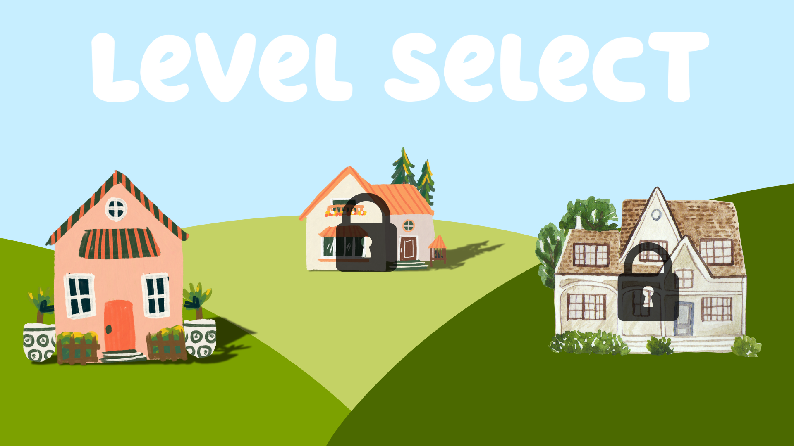
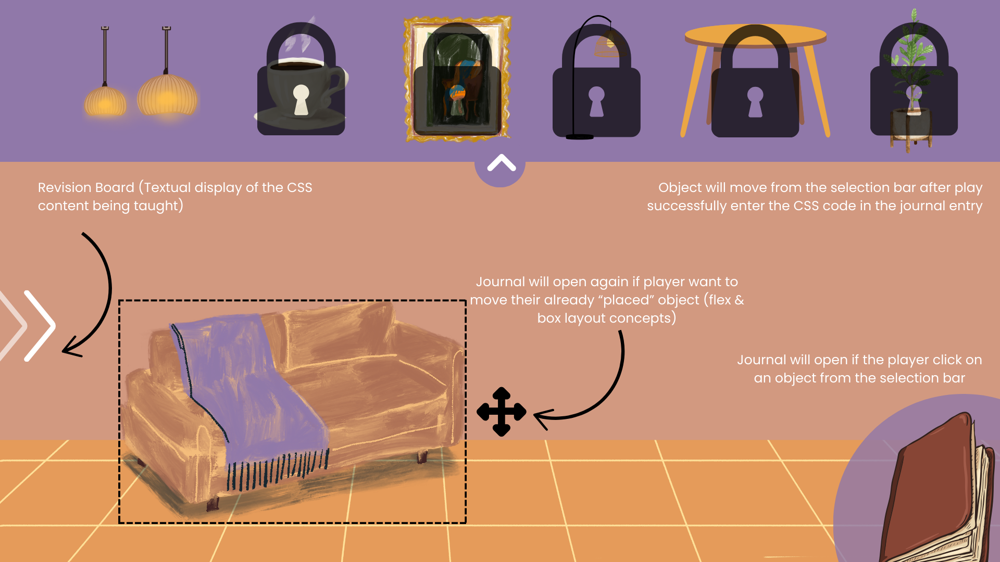
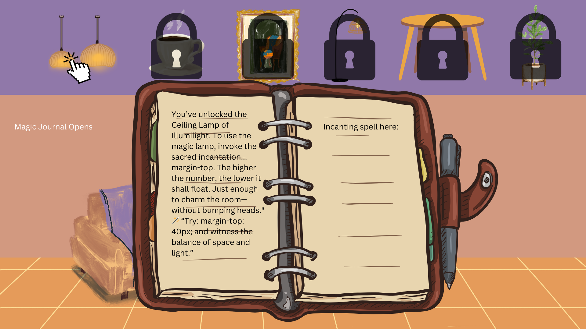
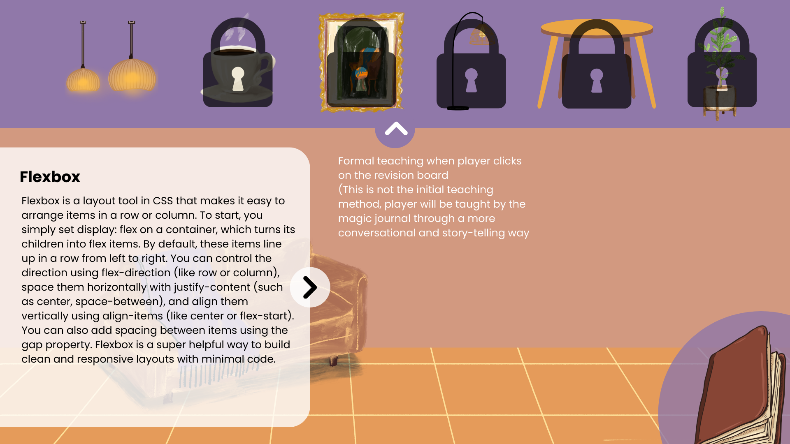
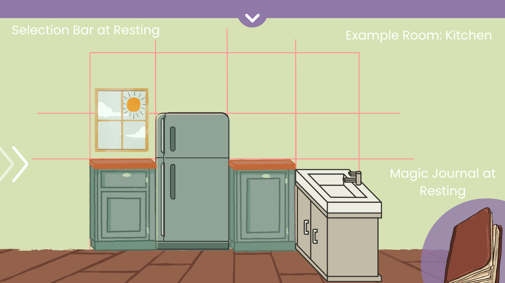
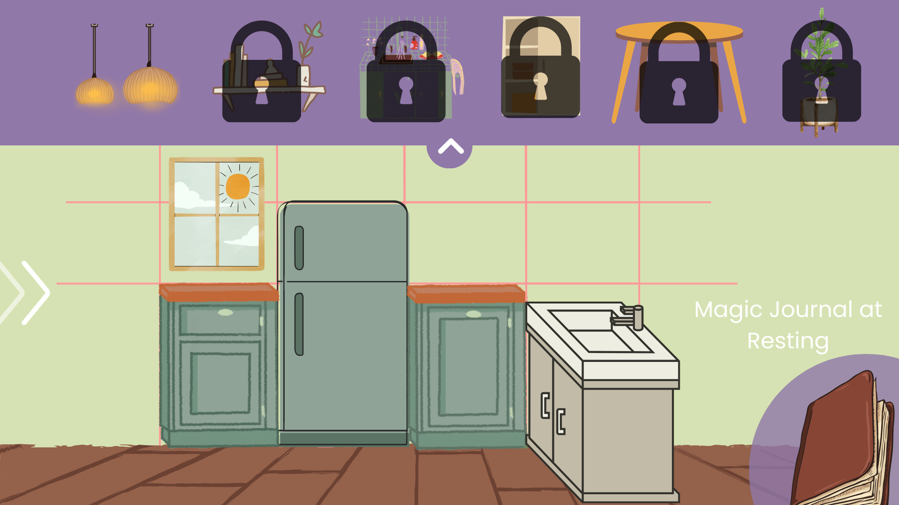
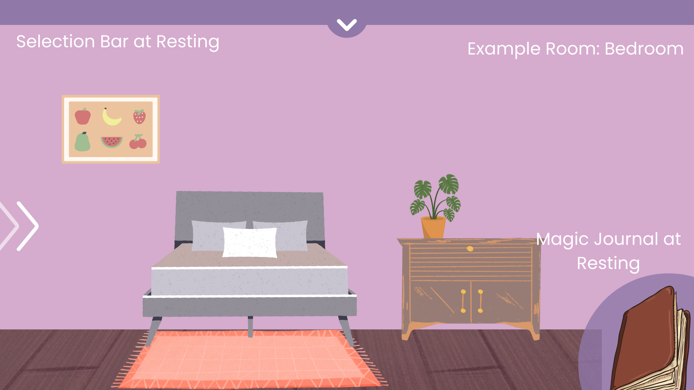
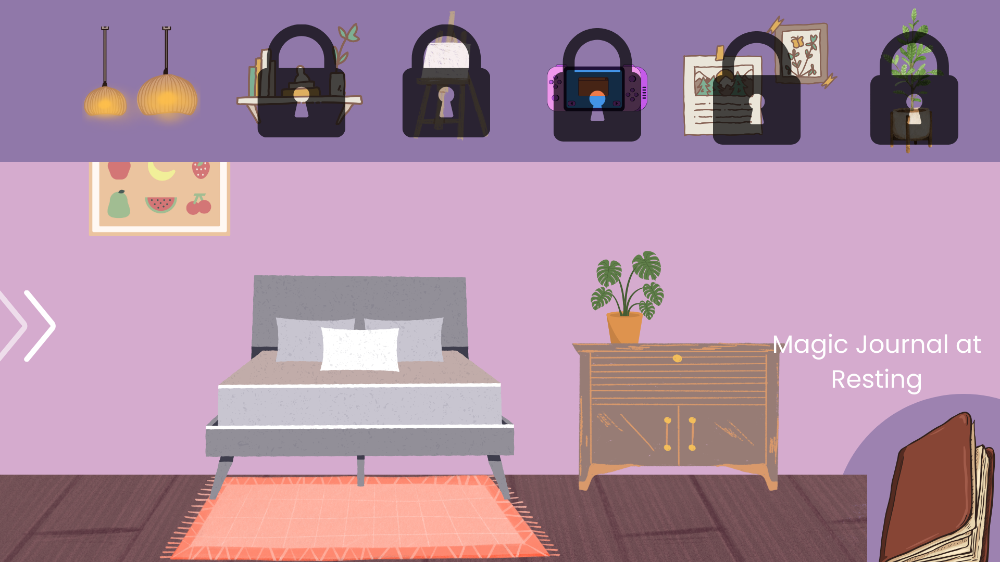
# Assets Needed

## Aethestics

*Give a sense of the aesthetics of your game, the spirit and atmosphere. Use descriptive, evocative words that can help the reader understand the emotional response of your game.*

## Graphical
*Early game sketches*
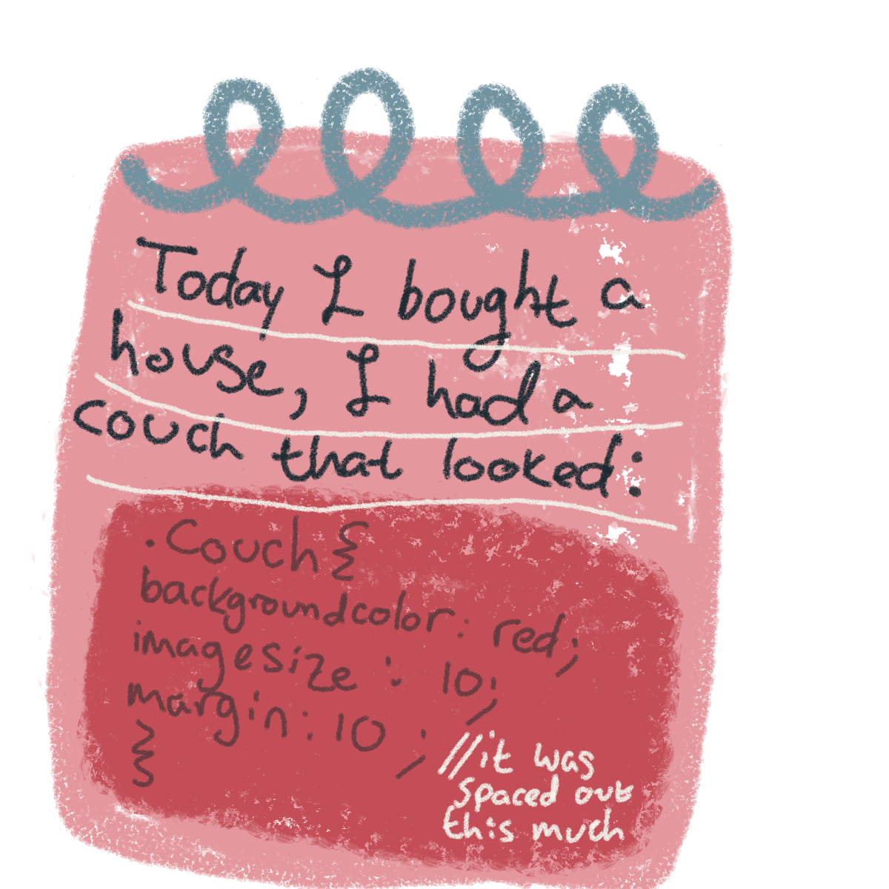

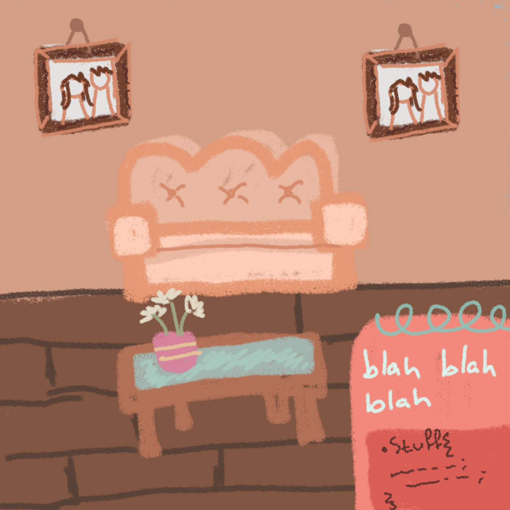
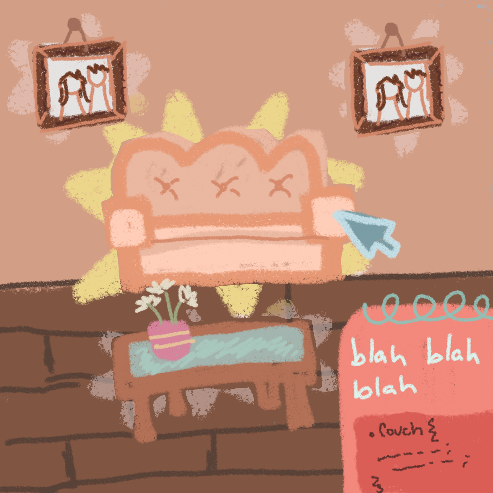

## Audio

*Game region/phase/time are ways of designating a particularly important place in the game.*

- Music List (Ambient sound) (Inspired, real soundtracks will be made by Jared Miller)
  - *Spring Music: https://youtu.be/fI9QzlD_sm0?si=jTUmsnK2eE8ATb0s*
  - *Summer Music: https://youtu.be/k0nqXeM-sns?si=uNHNTh5_Vu4V4RoJ*
  - *Fall Music: https://youtu.be/idOmc35hlhU?si=rzXzkLr-aTQjyhh-*
  - *Winter Music: https://youtu.be/AiX1dBfmftA?si=KOaiEYDmbUDvZd1t*

  
*Game Interactions are things that trigger SFX, like character movement, hitting a spiky enemy, collecting a coin.*

- Sound List (SFX)
- *Pen Writing: https://pixabay.com/sound-effects/scribble-6144/*
- *Button Click / Level Select: https://pixabay.com/sound-effects/old-radio-button-click-97549/*
- *Notebook Flip (Journal Pages): https://pixabay.com/sound-effects/page-flip-47177/* 
- *Hint bar open: https://pixabay.com/sound-effects/door-open-82528/*
- *Menu Hover: https://pixabay.com/sound-effects/hover-button-287656/*
- *Spell Success (CSS correctly applied): https://pixabay.com/sound-effects/window-blind-81230/*
- *Spell Fail (CSS error):* 
- *Furniture Placed or Moved:https://pixabay.com/sound-effects/pop-39222/* 
- *Room Unlocked: https://pixabay.com/sound-effects/success-48018/*
- *Item Unlocked: https://pixabay.com/sound-effects/item-pick-up-38258/*
- *New Concept Learned: https://uppbeat.io/sfx/ui-notification-positive-chimes/9473/25323*
- *CSS Input Confirmed: https://uppbeat.io/sfx/notification-correct-bell/6841/22200 *
- *Error Input or Failed Validation: https://uppbeat.io/sfx/notification-attention-needed/6827/22177*

# Metadata

* Template created by Austin Cory Bart <acbart@udel.edu>, Mark Sheriff, Alec Markarian, and Benjamin Stanley.
* Version 0.0.3